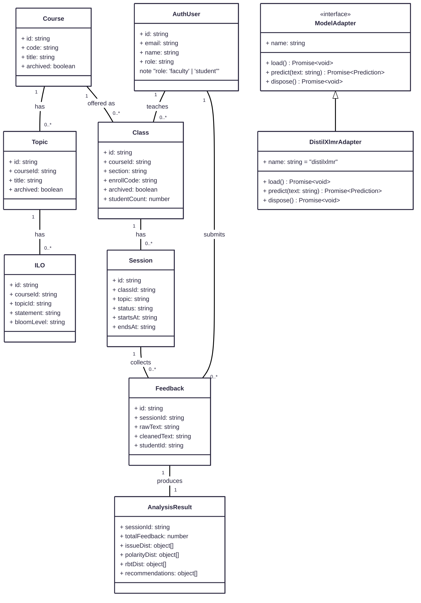

```mermaid
---
config:
  theme: redux
  look: classic
---

classDiagram

    class AuthUser {
        + id: string
        + email: string
        + name: string
        + role: string
        note "role: 'faculty' | 'student'"
    }

    class Course {
        + id: string
        + code: string
        + title: string
        + archived: boolean
    }

    class Topic {
        + id: string
        + courseId: string
        + title: string
        + archived: boolean
    }

    class ILO {
        + id: string
        + courseId: string
        + topicId: string
        + statement: string
        + bloomLevel: string
    }

    class Class {
        + id: string
        + courseId: string
        + section: string
        + enrollCode: string
        + archived: boolean
        + studentCount: number
    }

    class Session {
        + id: string
        + classId: string
        + topic: string
        + status: string
        + startsAt: string
        + endsAt: string
    }

    class Feedback {
        + id: string
        + sessionId: string
        + rawText: string
        + cleanedText: string
        + studentId: string
    }

    class AnalysisResult {
        + sessionId: string
        + totalFeedback: number
        + issueDist: object[]
        + polarityDist: object[]
        + rbtDist: object[]
        + recommendations: object[]
    }

    class ModelAdapter {
        <<interface>>
        + name: string
        + load() Promise~void~
        + predict(text: string) Promise~Prediction~
        + dispose() Promise~void~
    }

    class DistilXlmrAdapter {
        + name: string = "distilxlmr"
        + load() Promise~void~
        + predict(text: string) Promise~Prediction~
        + dispose() Promise~void~
    }

    %% Relationships
    ModelAdapter <|-- DistilXlmrAdapter

    Course "1" -- "0..*" Topic : has
    Topic "1" -- "0..*" ILO : has
    Course "1" -- "0..*" Class : offered as
    AuthUser "1" -- "0..*" Class : teaches
    Class "1" -- "0..*" Session : has
    Session "1" -- "0..*" Feedback : collects
    Feedback "1" -- "1" AnalysisResult : produces
    AuthUser "1" -- "0..*" Feedback : submits
```
