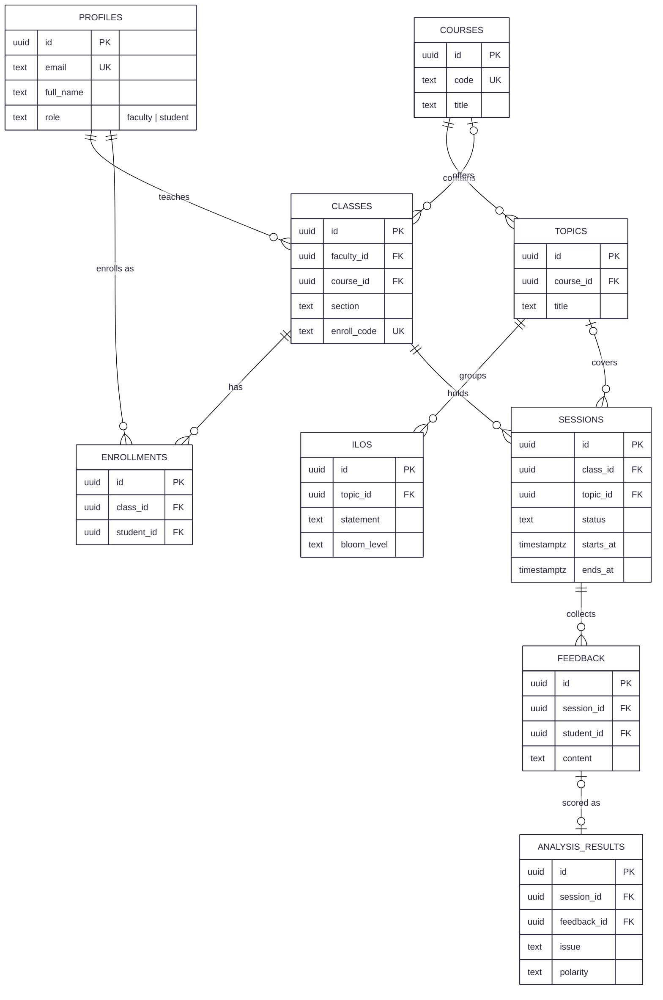

```mermaid
---
config:
  theme: redux
  look: classic
---
erDiagram
    PROFILES {
        uuid id PK
        text email UK
        text full_name
        text role "faculty | student"
    }

    COURSES {
        uuid id PK
        text code UK
        text title
    }

    TOPICS {
        uuid id PK
        uuid course_id FK
        text title
    }

    ILOS {
        uuid id PK
        uuid topic_id FK
        text statement
        text bloom_level
    }

    CLASSES {
        uuid id PK
        uuid faculty_id FK
        uuid course_id FK
        text section
        text enroll_code UK
    }

    ENROLLMENTS {
        uuid id PK
        uuid class_id FK
        uuid student_id FK
    }

    SESSIONS {
        uuid id PK
        uuid class_id FK
        uuid topic_id FK
        text status
        timestamptz starts_at
        timestamptz ends_at
    }

    FEEDBACK {
        uuid id PK
        uuid session_id FK
        uuid student_id FK
        text content
    }

    ANALYSIS_RESULTS {
        uuid id PK
        uuid session_id FK
        uuid feedback_id FK
        text issue
        text polarity
    }

    PROFILES ||--o{ CLASSES : teaches
    PROFILES ||--o{ ENROLLMENTS : "enrolls as"
    COURSES ||--o{ TOPICS : contains
    TOPICS ||--o{ ILOS : groups
    COURSES |o--o{ CLASSES : offers
    CLASSES ||--o{ ENROLLMENTS : has
    CLASSES ||--o{ SESSIONS : holds
    TOPICS |o--o{ SESSIONS : covers
    SESSIONS ||--o{ FEEDBACK : collects
    FEEDBACK |o--o| ANALYSIS_RESULTS : "scored as"
```
