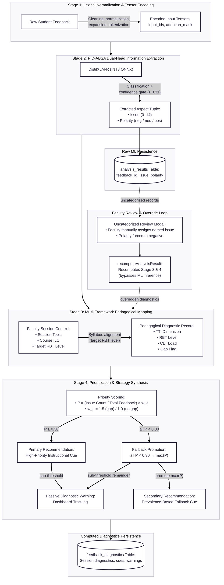

```mermaid
---
config:
  theme: redux
  look: classic
  flowchart:
    wrappingWidth: 1000
---
flowchart TB

    subgraph STAGE1["Stage 1: Lexical Normalization & Tensor Encoding"]
        direction LR
        RAW_INPUT["Raw Student Feedback"]
        TENSOR_ENC["Encoded Input Tensors:<br/>input_ids, attention_mask"]
        RAW_INPUT -->|"Cleaning, normalization,<br/>expansion, tokenization"| TENSOR_ENC
    end

    subgraph STAGE2["Stage 2: PID-ABSA Dual-Head Information Extraction"]
        direction LR
        INFERENCE_BLOCK["DistilXLM-R (INT8 ONNX)"]
        TUPLE_OUT["Extracted Aspect Tuple:<br/>• Issue (0–14)<br/>• Polarity (neg / neu / pos)"]
        INFERENCE_BLOCK -->|"Classification +<br/>confidence gate (≥ 0.31)"| TUPLE_OUT
    end

    subgraph PERSIST_RAW["Raw ML Persistence"]
        RAW_STORE[("analysis_results Table:<br/>feedback_id, issue, polarity")]
    end

    subgraph HUMAN_LOOP["Faculty Review & Override Loop"]
        direction TB
        UNCAT_REVIEW["Uncategorized Review Modal:<br/>• Faculty manually assigns named issue<br/>• Polarity forced to negative"]
        RECOMPUTE["recomputeAnalysisResult:<br/>Recomputes Stage 3 & 4<br/>(bypasses ML inference)"]
        UNCAT_REVIEW --> RECOMPUTE
    end

    subgraph STAGE3["Stage 3: Multi-Framework Pedagogical Mapping"]
        direction LR
        CONTEXT_IN["Faculty Session Context:<br/>• Session Topic<br/>• Course ILO<br/>• Target RBT Level"]
        DIAGNOSTIC_REC["Pedagogical Diagnostic Record:<br/>• TTI Dimension<br/>• RBT Level<br/>• CLT Load<br/>• Gap Flag"]
        CONTEXT_IN -->|"Syllabus alignment<br/>(target RBT level)"| DIAGNOSTIC_REC
    end

    subgraph STAGE4["Stage 4: Prioritization & Strategy Synthesis"]
        direction TB
        PRIORITY_SCORER["Priority Scoring:<br/>• P = (Issue Count / Total Feedback) × w_c<br/>• w_c = 1.5 (gap) / 1.0 (no gap)"]
        PRIMARY_REC["Primary Recommendation:<br/>High-Priority Instructional Cue"]
        FALLBACK_PROMOTE["Fallback Promotion:<br/>all P < 0.30 → max(P)"]
        SECONDARY_REC["Secondary Recommendation:<br/>Prevalence-Based Fallback Cue"]
        TERMINAL_WARN["Passive Diagnostic Warning:<br/>Dashboard Tracking"]

        PRIORITY_SCORER -->|"P ≥ 0.30"| PRIMARY_REC
        PRIMARY_REC -->|"sub-threshold"| TERMINAL_WARN
        PRIORITY_SCORER -->|"all P < 0.30"| FALLBACK_PROMOTE
        FALLBACK_PROMOTE -->|"promote max(P)"| SECONDARY_REC
        FALLBACK_PROMOTE -->|"sub-threshold remainder"| TERMINAL_WARN
    end

    subgraph PERSIST_DIAG["Computed Diagnostics Persistence"]
        DIAG_STORE[("feedback_diagnostics Table:<br/>Session diagnostics, cues, warnings")]
    end

    STAGE1 --> STAGE2
    TUPLE_OUT --> RAW_STORE
    STAGE2 --> STAGE3
    RAW_STORE -.->|"uncategorized records"| UNCAT_REVIEW
    RECOMPUTE -.->|"overridden diagnostics"| STAGE3
    STAGE3 --> STAGE4
    STAGE4 --> DIAG_STORE

    %% 'Uncategorized' issues are excluded from scoring unless reclassified via faculty manual overrides
```
