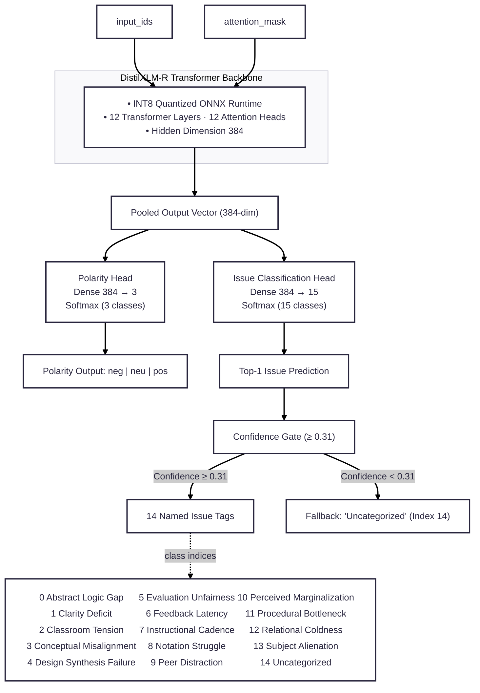

```mermaid
---
config:
  theme: redux
  look: classic
  flowchart:
    wrappingWidth: 1000
---
flowchart TB

    INPUT_IDS["input_ids"]
    ATT_MASK["attention_mask"]

    subgraph BACKBONE["DistilXLM-R Transformer Backbone"]
        ENCODER["• INT8 Quantized ONNX Runtime<br/>• 12 Transformer Layers · 12 Attention Heads<br/>• Hidden Dimension 384"]
    end

    POOLED["Pooled Output Vector (384-dim)"]

    POL_HEAD["Polarity Head<br/>Dense 384 → 3<br/>Softmax (3 classes)"]
    ISS_HEAD["Issue Classification Head<br/>Dense 384 → 15<br/>Softmax (15 classes)"]

    POL_OUT["Polarity Output: neg | neu | pos"]
    ISS_OUT["Top-1 Issue Prediction"]

    GATE["Confidence Gate (≥ 0.31)"]
    TAGS["14 Named Issue Tags"]
    FALLBACK["Fallback: 'Uncategorized' (Index 14)"]

    LEG_COL["<table><tr><td>0 Abstract Logic Gap</td><td>5 Evaluation Unfairness</td><td>10 Perceived Marginalization</td></tr><tr><td>1 Clarity Deficit</td><td>6 Feedback Latency</td><td>11 Procedural Bottleneck</td></tr><tr><td>2 Classroom Tension</td><td>7 Instructional Cadence</td><td>12 Relational Coldness</td></tr><tr><td>3 Conceptual Misalignment</td><td>8 Notation Struggle</td><td>13 Subject Alienation</td></tr><tr><td>4 Design Synthesis Failure</td><td>9 Peer Distraction</td><td>14 Uncategorized</td></tr></table>"]

    INPUT_IDS --> ENCODER
    ATT_MASK --> ENCODER
    ENCODER --> POOLED
    POOLED --> POL_HEAD
    POOLED --> ISS_HEAD
    POL_HEAD --> POL_OUT
    ISS_HEAD --> ISS_OUT
    ISS_OUT --> GATE
    GATE -->|"Confidence ≥ 0.31"| TAGS
    GATE -->|"Confidence < 0.31"| FALLBACK
    TAGS -.->|"class indices"| LEG_COL
```
