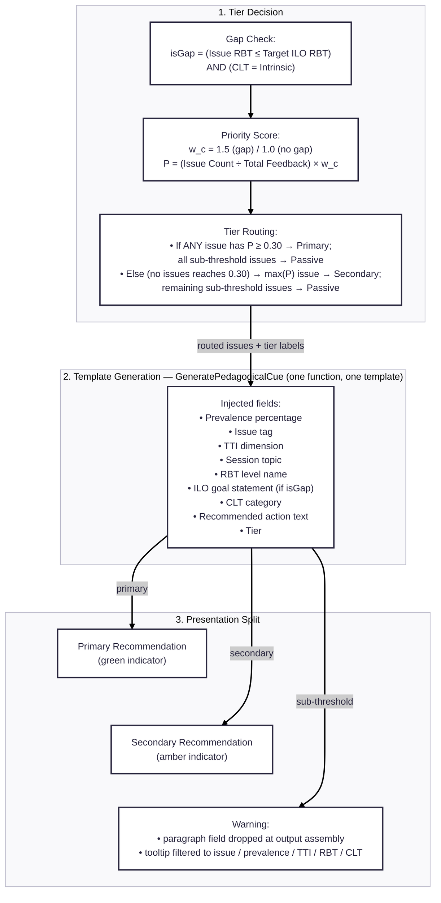

_Note — SOP4 scope: "recommendation" covers both actionable cues (Primary & Secondary) and diagnostic warnings (Passive); all three are produced by the same generation call._

## Worked Example — Abstract Logic Gap

Grounded in the CSEG2 seed session: topic "Introduction to Game Programming", target ILO RBT = 4 (Analyze), 6 of 25 responses tagged Abstract Logic Gap.

1. **Engine (tier decision)** — RBT 4 (Analyze) ≤ target RBT 4 AND CLT = Intrinsic → isGap = true → w_c = 1.5 → P = (6/25) × 1.5 = 0.36 ≥ 0.30 → routed **Primary**.
2. **Template generation (8 injected fields)**:

   | Field                              | Value                                                                                                                                                                          |
   | ---------------------------------- | ------------------------------------------------------------------------------------------------------------------------------------------------------------------------------ |
   | Prevalence percentage              | 36% (boosted from 24% by the isGap weight)                                                                                                                                     |
   | Issue tag                          | Abstract Logic Gap                                                                                                                                                             |
   | TTI dimension                      | Concept Development                                                                                                                                                            |
   | Session topic                      | Introduction to Game Programming                                                                                                                                               |
   | RBT level name                     | Analyze                                                                                                                                                                        |
   | ILO goal statement (only if isGap) | Analyze game mechanics and implement gameplay systems using object-oriented design                                                                                             |
   | CLT category                       | Intrinsic                                                                                                                                                                      |
   | Recommended action text            | It is recommended to introduce complex logical concepts piece-by-piece using a sequential scaffold that bridges the gap between basic understanding and higher-order analysis. |

3. **Presentation split** — tier = "primary" stamped onto the output object; the UI renders the green-indicator recommendation cue with hover-detail paragraphs. Field dropping and tooltip filtering apply only to the Passive branch.

_Excluded from this diagram by design: the per-issue TTI/RBT/CLT mappings, which live in Table 2 — the Pedagogical Mapping Taxonomy (`pedagogical_mapping_taxonomy.md`)._
