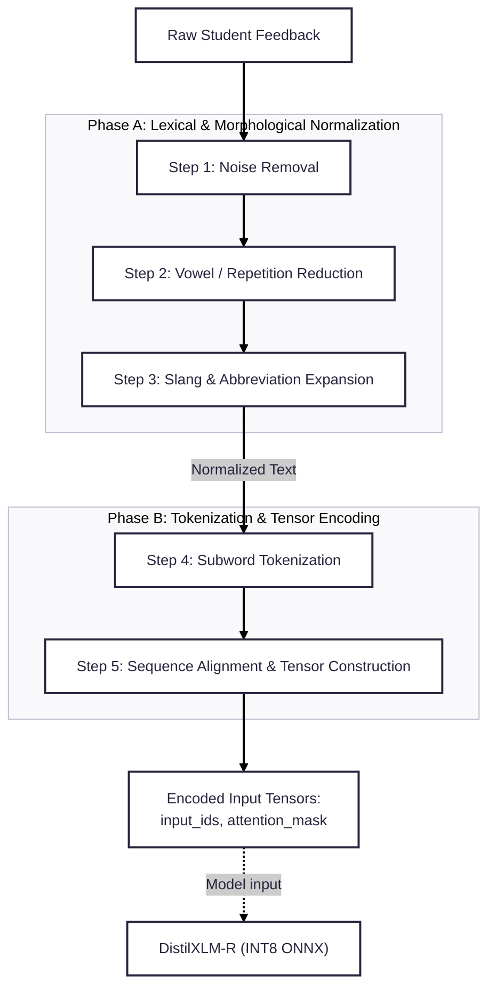

```mermaid
---
config:
  theme: redux
  look: classic
  flowchart:
    wrappingWidth: 1000
---
flowchart TB

    RAW["Raw Student Feedback"]

    subgraph PHASE_A["Phase A: Lexical & Morphological Normalization"]
        direction TB
        P1_NOISE["Step 1: Noise Removal"]
        P1_VOWEL["Step 2: Vowel / Repetition Reduction"]
        P1_ABBREV["Step 3: Slang & Abbreviation Expansion"]
        P1_NOISE --> P1_VOWEL --> P1_ABBREV
    end

    subgraph PHASE_B["Phase B: Tokenization & Tensor Encoding"]
        direction TB
        P2_TOKENIZE["Step 4: Subword Tokenization"]
        P2_TENSORS["Step 5: Sequence Alignment & Tensor Construction"]
        P2_TOKENIZE --> P2_TENSORS
    end

    TENSOR_OUT["Encoded Input Tensors:<br/>input_ids, attention_mask"]
    MODEL["DistilXLM-R (INT8 ONNX)"]

    RAW --> P1_NOISE
    P1_ABBREV -->|"Normalized Text"| P2_TOKENIZE
    P2_TENSORS --> TENSOR_OUT
    TENSOR_OUT -.->|"Model input"| MODEL
```
