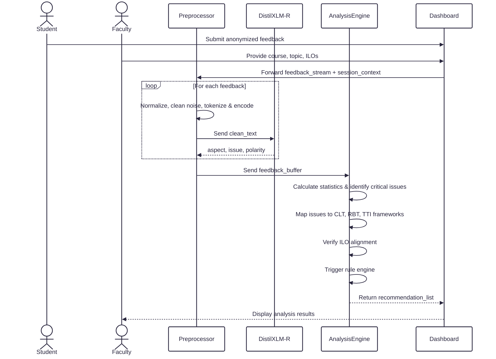

```mermaid
---
config:
  theme: redux
  look: classic
---
sequenceDiagram
    actor Student
    actor Faculty
    participant Preprocessor
    participant DistilXLM-R
    participant AnalysisEngine
    participant Dashboard

    Student->>Dashboard: Submit anonymized feedback
    Faculty->>Dashboard: Provide course, topic, ILOs

    Dashboard->>Preprocessor: Forward feedback_stream + session_context

    loop For each feedback
        Preprocessor->>Preprocessor: Normalize, clean noise, tokenize & encode
        Preprocessor->>DistilXLM-R: Send clean_text
        DistilXLM-R-->>Preprocessor: aspect, issue, polarity
    end

    Preprocessor->>AnalysisEngine: Send feedback_buffer

    AnalysisEngine->>AnalysisEngine: Calculate statistics & identify critical issues
    AnalysisEngine->>AnalysisEngine: Map issues to CLT, RBT, TTI frameworks
    AnalysisEngine->>AnalysisEngine: Verify ILO alignment
    AnalysisEngine->>AnalysisEngine: Trigger rule engine

    AnalysisEngine-->>Dashboard: Return recommendation_list
    Dashboard-->>Faculty: Display analysis results
```
